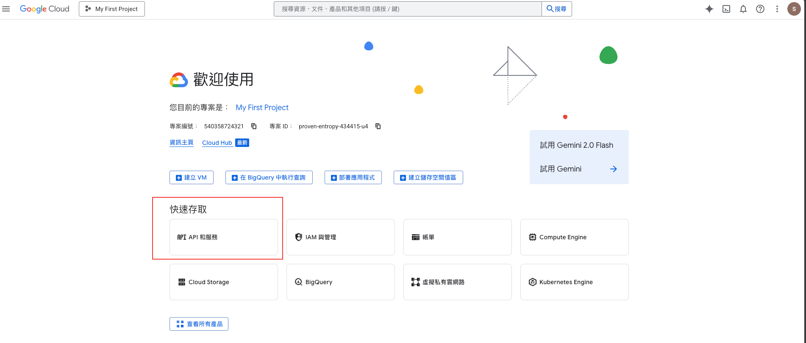

# terraform_aws_pratice_with_py_flask


```commandline
brew install --cask google-cloud-sdk
```

```commandline
gcloud init
```


gui enable



```commandline
gcloud services enable compute.googleapis.com
```

```commandline
gcloud iam service-accounts create terraform-sa --display-name "Terraform SA"

```


```commandline
gcloud projects add-iam-policy-binding your-project-id \
  --member="serviceAccount:terraform-sa@your-project-id.iam.gserviceaccount.com" \
  --role="roles/owner"
```


```commandline
gcloud iam service-accounts keys create key.json \
  --iam-account terraform-sa@your-project-id.iam.gserviceaccount.com

```